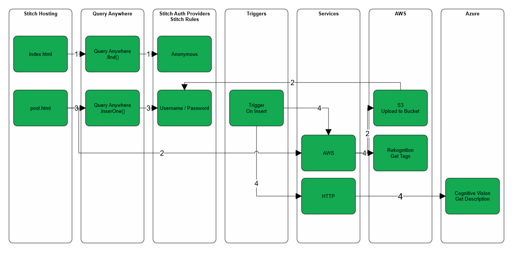
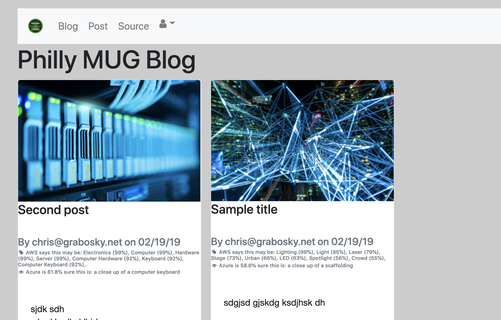

# PhillyMUG201903

## Background
This application is an example MongoDB Stitch application built for the [PhillyMUG meetup in March of 2019](https://www.meetup.com/Philadelphia-MongoDB-User-Group/events/258766284/).

It is a simple blog where anyone can register an account and post. It is all powered via serverelss and front-end JavaScript and HTML.

## Technologies
* [MongoDB Atlas](https://docs.atlas.mongodb.com/) - MongoDB Database as a Service
* [Mongo Stitch](https://docs.mongodb.com/stitch/) - Serverless platform for MongoDB Atlas
* [AWS S3](https://aws.amazon.com/s3/) - Storage
* [AWS Rekognition](https://aws.amazon.com/rekognition/) - Object and Scene Analysis
* [Azure Cognitive Vision API](https://azure.microsoft.com/en-us/services/cognitive-services/computer-vision/) - Object and Scene Analysis
* [BootStrap 4](https://getbootstrap.com/) - Layout
* [Font Awesome](https://fontawesome.com/v4.7.0/icons/) - Icons
* [jQuery](https://jquery.com/) - DOM maniuplation 

## Admin Setup Workflow
* Create a MongoDB Atlas account 
* Deploy a cluster (free tier of M0 should work)
* Create a database called `blog` with a collection called `blog`
* Create a Stitch application and connect it to that cluster and the DB
* Get your AWS IAM API Key and update the `StitchApp` `AWS config.js` with your key
* Create an S3 bucket within the AWS console
* Generate a API key for Azure 
* Enable Azure Cognitive Vision API 
* Put key in the `values/cvaAccessKey.json`
* Using `stitch-cli` push the Stitch app
* Enable hosting on your Stitch App 
* Edit `Hosting/includes/conf.js` and update top few lines with stitch app name, bucket, etc
* Put all files in `Hosting` folder into Stitch hosting
* Edit email/password provider links for your new hosting URLs
* Confirm all rules, users, providers, etc were imported 

## Scenario
* User visits the application
* Home page will show most recent 10 blog posts
* User can register (`user/signup.html`) for a new account 
* Email goes out to user (check your junk folder!)
* User cofirms via `user/emailregistration.html`
* User goes to `post.html` 
* If not logged in, they are redirected to `user/index.html` where they login then bounce back to `post.html` 
* User chooses a hero image form thier computer, chooses upload 
* App will push this image to S3 and update the path
* User enters a title and post and submits
* Trigger runs in background to run Rekognition and adds field on what Rekognition thinks the image is
* Trigger runs in background to run Cognitive Vision API (cva) of what Azure thinks the image is
* All viewable in `index.html` 

## Screenshots

